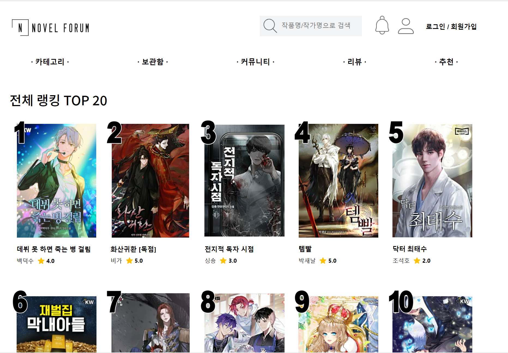

# Novel Forum

<h3>소개</h3>

- 오늘날에는 웹소설 연재 플랫폼이 굉장히 많아 어디에 어떤 작품이 올라왔는지 확인하기 어려운 상황입니다.

- 때문에, 어떤 플랫폼에 어떤 소설이 올라와 있는지 확인할 수 있는 사이트를 만들고자 합니다.
- 다만, 단순히 어디에 어떤 소설이 있는지 확인하는 것에서 그치지 않고, 나에게 맞는 소설을 추천해주는 기능을 비롯하여 다양한 기능을 가진 사이트를 만들어보고자 합니다.

<h3>팀</h3>

숭실대학교 2023년 1학기 전공종합설계 
<h5>프론트엔드</h5>

- 20170575 김현정
- 20180810 정지오
 
 
<h5>백엔드</h5>

- 20180736 김진수
- 20182607 류정훈

 
 
<h3>기술스택</h3>

 

   
   
    
   
  

   
   

  <h3> 메인 화면 </h3>
  

  

   
   
  <h3>주요 기능</h3>
  

  
  - <strong>소설 탐색<strong> 
  -  <strong>소설 추천<strong> 
  - <strong>보관함 공유<strong>